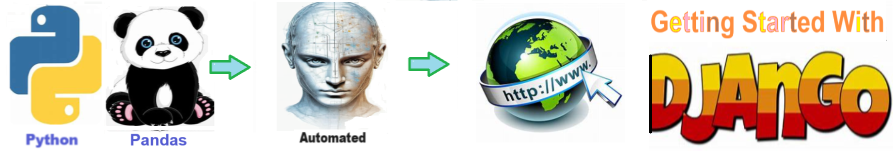
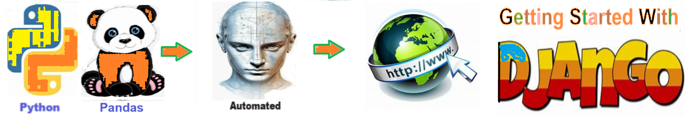
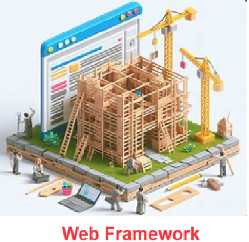

# Getting Started With Django - Git allows you to quickly download pre-built solutions  

## Overview of Django

**Django** is a high-level Python web framework renowned for its efficiency and robustness in building web applications. It follows the "Don't Repeat Yourself" (DRY) principle, enabling developers to write clean, maintainable code by emphasizing reusability and reducing redundancy. 

With its built-in features for handling tasks like URL routing, database management, and user authentication, Django significantly accelerates the development process, making it a popular choice among developers for creating secure, scalable web applications.

## Introduction to the Django Framework
**Django** is a high-level Python **web framework** that encourages rapid development and clean, pragmatic design. It is designed to help developers take applications from concept to completion as swiftly as possible. With a focus on automating as much as possible and adhering to the DRY (Don't Repeat Yourself) principle, Django provides an efficient and effective path for building robust web applications.

### Who Can Use Django?
1. **Beginners**: Django is an excellent choice for those new to web development. Its well-documented, high-level framework allows beginners to quickly grasp the basics of web development while avoiding many common pitfalls. 
2. **Experienced Developers**: For seasoned developers, Django offers a comprehensive suite of tools and libraries that streamline the development process. This enables the creation of complex applications with less code and in a shorter timeframe.
3. **Startups and Small Businesses**: Django's rapid development capabilities make it ideal for startups and small businesses that need to get their applications to market quickly and iteratively improve them.

### Advantages of Using Django
- **Rapid Development**: Django’s framework includes ready-to-use components, such as authentication, content administration, and RSS feeds, allowing developers to build applications quickly.
- **Scalability**: Django is designed to help developers build applications that can scale seamlessly. It can handle high traffic volumes and large amounts of data efficiently.
- **Security**: Django provides built-in protection against common security threats like SQL injection, cross-site scripting, and cross-site request forgery.
- **Community and Support**: With a vibrant community and extensive documentation, Django developers can easily find solutions to their problems and continuously improve their skills through mini-projects and collaborative efforts.

## Conclusion 

**Django**  is a versatile and powerful framework suitable for a wide range of users, from beginners to experienced developers. Its emphasis on rapid development, scalability, and security makes it a valuable tool for building effective web applications. Whether you are a novice looking to learn web development through mini-projects or a seasoned developer aiming to enhance your productivity, Django provides the necessary tools and support to achieve your goals.

## Getting Started

The goal of this solution is to **Jump Start** your development and have you up and running in 30 minutes. 

To get started with the **Getting Started With Django** solution repository, follow these steps:
1. Clone the repository to your local machine.
2. Install the required dependencies listed at the top of the notebook.
3. Explore the example code provided in the repository and experiment.
4. Run the notebook and make it your own - **EASY !**
    
## Solution Features
- Easy to understand and use  
- Easily Configurable 
- Quickly start your project with pre-built templates
- Its Fast and Automated

## Notebook Features

These Features are design to provide everything you need for **Knowledge Transfer** 

- **Self Documenting** - Automatically identifes major steps in notebook 
- **Self Testing** - Unit Testing for each function
- **Easily Configurable** - Easily modify with **config.INI** - keyname value pairs
- **Includes Talking Code** - The code explains itself 
- **Self Logging** - Enhanced python standard logging   
- **Self Debugging** - Enhanced python standard debugging
- **Low Code** - or - No Code  - Most solutions are under 50 lines of code
- **Educational** - Includes educational dialogue and background material
    
## List of Figures
       
    

## Github https://github.com/JoeEberle/ - Email  josepheberle@outlook.com 
    

    